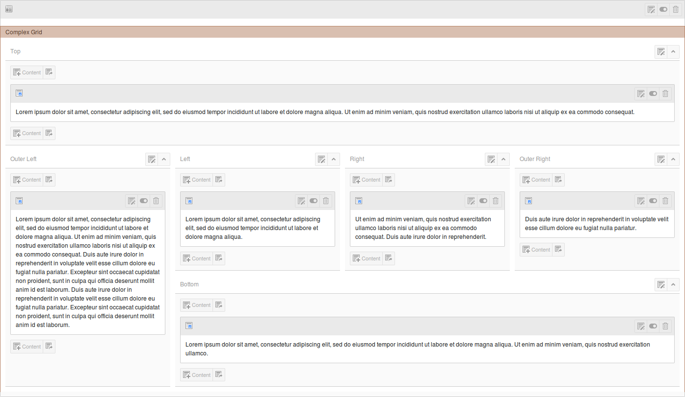
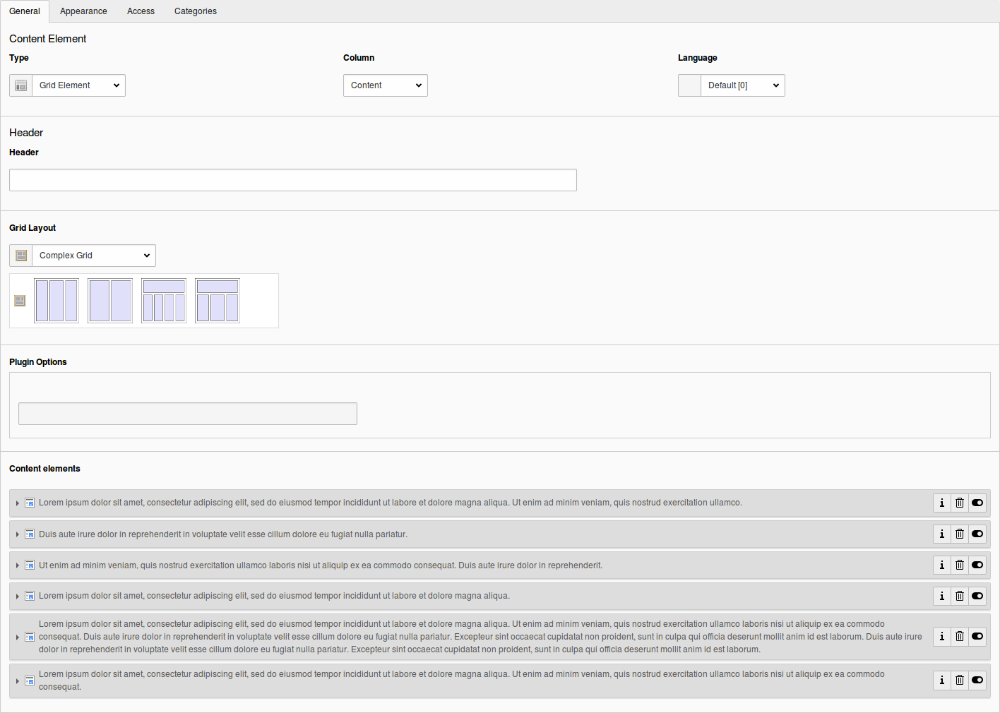

.. ==================================================
.. FOR YOUR INFORMATION
.. --------------------------------------------------
.. -*- coding: utf-8 -*- with BOM.

.. ==================================================
.. DEFINE SOME TEXTROLES
.. --------------------------------------------------
.. role::   underline
.. role::   typoscript(code)
.. role::   ts(typoscript)
   :class:  typoscript
.. role::   php(code)

.. _GridTsSyntax:

Grid TS Syntax
--------------

The syntax we use to store information about the grid structure within
the page and CE backend layout records is basically *TypoScript* .
Both grid view and grid elements are using the internal TS parser of
the core to transform this syntax into an array, which is then used by
the different methods we attached to the hooks provided by the core.

We could have used serialized objects or arrays as well, but decided
to go for TypoScript, since this can easily be written by advanced
integrators. For those, who are not familiar with TypoScript or just
prefer the usability of a point and click interface, there is a
comfortable :ref:`Grid Wizard <GridWizard>`, that will help
to create the TypoScript code. Later on it might be more convenient to
modify the structures by hand, especially when backend layouts that
are based on a similar structure haven't got too many differences.

Step by step:
^^^^^^^^^^^^^

Start with the number of columns and rows
"""""""""""""""""""""""""""""""""""""""""

Go to the **Configuration** tab of the layout record and use the
wizard to create the **Grid Configuration** there. It is not possible
to directly edit the configuration there anymore, but you will get an
overview about the TypoScript structure of the configuration, when you
click on the button below the wizard.

Historically the wrapper for the whole block was the same as for pages:
**backend\_layout** – when you are providing the configuration via files,
**this has to be removed though!**

::

  config {
    backend_layout {
      ...
    }
  }

becomes

::

  config {
    ...
  }

Use the keys **colCount** and **rowCount** to create the basic grid
structure. Both values should be at least the lowest common multiple of
the column sizes you want to create. They represent the actual grid behind
the cell structure. The calculation should take into account that you
might be using colspan and rowspan as well.

::

  config {
    colCount = 4
    rowCount = 3
  }

Fill in the rows
""""""""""""""""

The array of rows does not offer any specialties. It is just a simple
array with numeric keys. You will need a key for each possible row,
even though it might stay empty later on.

::

  config {
    colCount = 4
    rowCount = 3
    rows {
      1 {
      ...
      }
      2 {
      ...
      }
      3 {
      ...
      }
    }
  }

Create the cells
""""""""""""""""

Each of the cells comes with up to 7 different keys: **name**,
**colPos**, **colspan**, **rowspan**, **allowed**, **disallowed**
and **maxitems**. There must be at least the **name** and if
you want to use the column as something else than a placeholder, there
must be a value for **colPos** as well. Otherwise the cell will be
marked as *inactive* in the page module.

The values for **colspan** , **rowspan**, **allowed**, **disallowed**
and **maxitems** are optional.

The **allowed** feature is used to determine those content
element types the user will be allowed to use within this column. You
can use an array with **CType**, **list_type** and **tx_gridelements_backend_layout**
as keys here and as soon as one of those contains at least one value,
any other type or layout will be forbidden.

**CType** determines the content element types, **list_type** the plugin types
**tx_gridelements_backend_layout** the grid element types that are allowed
in that particular column. The syntax matches that of the content defender
extension so people using that will not have to change their configuration anymore.

Same goes for the **disallowed** feature which is the black list variant of the
**allowed** feature. While **alowed** explicitely lists those elements, the
user may put into that column, **disallowed** will exclude specific element list
or grid types keeping all others available. **disallowed** will override **allowed**
in case they contain the same values.

The **maxitems** feature will limit the maximum number of content elements to be put
in that column. Columns having that limit will get a small counter box at the upper right.
Limiting the number of elements will NOT completely restrict elements there, since users might
switch a layout and won't be able to touch the then superfluous elements anymore.
Still it will remove buttons and give visual feedback when the maximum number of elements
has been reached (orange counter) or exceeded (red counter and items).

The **colPos** value will be used while fetching the
content elements from the database, since grid view and grid elements
are using normalized relations to relate columns and content elements
with each other.

The following example will create a cell for a larger top column with
only *text* and *text with image* allowed as a content type:

::

  config {
    colCount = 4
    rowCount = 3
    rows {
    1 {
      columns {
        1 {
          name = Top
          colspan = 4
          colPos = 0
          allowed {
            CType = text,textpic
          }
        }
      }
    }
    2 {
      columns {
        1 {
          name = Outer Left
          rowspan = 2
          colPos = 1
          allowed {
            CType = text,textpic
            tx_gridelements_backend_layout = 2ColumnContainer,3ColumnContainer
          }
        }
        2 {
          name = Left
          colPos = 2
          allowed = *
          disallowed {
            CType = text,textpic
            tx_gridelements_backend_layout = 2ColumnContainer,3ColumnContainer
          }
        }
        3 {
          name = Right
          colPos = 3
          maxitems = 4
        }
        4 {
          name = Outer Right
          colPos = 4
        }
      }
    }
    3 {
      columns {
        1 {
          name = Bottom
          colspan = 4
          colPos = 5
        }
      }
    }
  }

This is the visible result of the example code

.. :align: center
.. :name: Result of example code

When you now edit this grid element, you can see how the child
elements are connected to their parent grid via the core functions
provided by Inline Relational Record Editing (IRRE). You will even be
able to edit any element within a possible tree of nested grids and
their children without having to deal with the whole page module, but
of course you will lose the structured view of the grid this way.
Sorting by D&D or clicking on the sorting arrows will be disabled
inside the editing form as well. But you still can sort elements by
directly dragging and dropping them in the page module.

.. :align: center
.. :name: Edit page content
